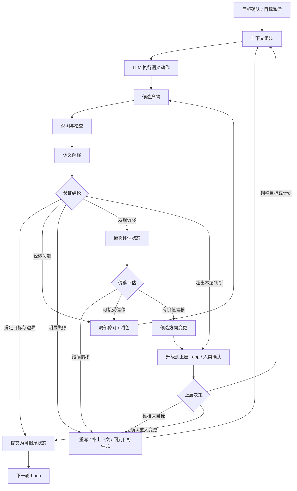

# Harness 设计原则

## 1. 文档定位

本文记录本项目的定位、核心工程判断和 Agent Loop Harness 设计原则。

本文不定义具体写作流程，不定义状态字段、工具接口或实现细节。本文只在原则层描述 loop 分层、LLM 与 harness 的职责边界。公开的实现说明由 [架构说明](./architecture.md)、[本地使用](./local-usage.md) 和代码本身承载。

## 2. 项目定位

本项目可以作为个人工程展示项目，并适合在 GitHub 公开展示。

它的主要价值不是证明“AI 可以写小说”，而是通过 AI 长篇小说写作这个具体领域，展示对 Agent Loop Harness 的工程理解。

AI 写小说是一个合适的领域载体，因为它天然需要长期运行、持续继承上下文、不断校验目标，并且很容易暴露 agent 系统的典型问题：

- 目标在长任务中逐渐衰减。
- 角色、设定、伏笔和剧情方向在执行中漂移。
- 单次生成看起来合理，但多轮累积后整体跑偏。
- 模型能继续生成内容，却不一定知道当前是否仍在完成原目标。

因此，本项目关注的问题可以表述为：

```text
如何设计一个能够长期运行，并且不容易在长期运行中跑偏的 Agent Loop Harness。
```

## 3. 核心判断

长期运行本身不是最难的问题。真正困难的是：系统在长期运行时，仍然知道自己要完成什么、当前做到哪里、是否已经偏离目标，以及偏离后应该如何恢复。

在 AI 小说写作中，LLM 很擅长执行生成任务。它可以写设定、写大纲、写章节、写对白，也可以继续生成很多轮内容。

但稳定写出没有明显缺陷的长篇小说，难点不只在“执行”，而在于执行之后能不能持续回答这些问题：

- 当前章节是否完成了本章目标？
- 角色行为是否仍符合已建立的动机、认知和关系？
- 世界设定、已发生事实和用户要求是否被破坏？
- 伏笔是否被遗忘、误回收、污染或无痕废弃？
- 新生成的内容是否偷偷改变了长期故事方向？
- 当前应该继续写、局部修订、重写、回到规划，还是暂停确认？

这些问题构成了本项目的核心工程场景。

## 4. 对 Loop 的理解

本项目中的 loop 不是简单地让 LLM 一直自我调用。

Loop 的主体是 harness：harness 决定每一轮怎么开始、给 LLM 什么上下文、如何处理 LLM 的输出，以及下一步是继续、提交、修订还是回退。LLM 负责完成其中需要语义能力的生成、判断和解释任务。

一个稳定的 agent loop 至少包含以下环节：

```text
定目标 -> 构造上下文 -> 执行 -> 观测与解释 -> 验证 -> 状态提交或纠偏 -> 下一轮
```

其中：

- 定目标：把用户需求、作品方向、当前阶段目标和本轮任务明确下来。
- 构造上下文：由 harness 决定本轮 LLM 应该看到什么目标、状态、历史、约束和工具。
- 执行：让 LLM 完成语义任务，例如规划、写作、审稿、抽取或解释偏差。
- 观测与解释：把执行结果转化为验证可以使用的信号，并在需要时让 LLM 解释语义变化。
- 验证：判断这些信号是否满足目标、边界和当前状态约束。
- 状态提交：只有通过边界控制的结果，才能进入下一轮可继承状态。
- 纠偏：在失败、偏离或不确定时，选择修订、重写、回到规划、暂停确认或恢复。

在这个结构里，最关键的不是“执行”本身，而是上下文构造、观测、验证和状态提交。

如果系统不能正确构造上下文，LLM 可能从一开始就在错误状态上执行；如果系统不能观测执行结果，它就不知道发生了什么；如果系统不能验证观测结果，它就不知道是否仍在正确方向上运行；如果系统不能控制状态提交，错误结果会进入下一轮上下文并被持续放大。

观测信号本身不是可继承状态。它先作为验证输入；只有通过验证并被提交或记录后，才会成为同层下一轮或上层 loop 可以继承的状态与反馈。

这样的 loop 即使能运行很久，也只是持续生成，而不是稳定推进。

## 5. 分层闭环 Agent Harness

本项目中的 loop 不是单层循环，而是分层闭环。

更准确地说，本项目把长篇小说写作建模为一个分层闭环 Agent Harness：

```text
全书 Loop
  故事弧 Loop
    章节 Loop
```

“分层闭环 Agent Harness”是本文对项目结构的描述，不把它当作行业固定术语。它对应的主流思想包括 hierarchical agent loop、closed-loop orchestration 和 multi-level feedback loop。

这种表述对应的是更通用的工程思想：高层 loop 负责长期目标和方向约束，低层 loop 负责局部执行和可提交进展；低层执行结果通过观测和验证反馈给高层，高层再决定是否维持方向、调整目标或触发纠偏。

在本项目中：

- 全书 Loop 负责长期方向、类型承诺、主线推进、角色长期弧线和终局目标。
- 故事弧 Loop 负责阶段目标、多章累积效果、节奏变化、阶段性伏笔推进和阶段收束。
- 章节 Loop 负责单章目标、正文生成、观测、验证、修订和提交。

三层 loop 不是并列任务，而是上下游关系：

- 全书目标约束故事弧目标。
- 故事弧目标约束章节目标。
- 章节执行结果反馈给故事弧。
- 故事弧结果反馈给全书方向。

因此，章节 loop 通过不代表故事弧一定健康；故事弧通过也不代表全书方向一定没有漂移。长篇写作需要多层 loop 分别承担不同时间尺度的目标约束、观测、验证和纠偏。

面向外部沟通时，可以把这个设计表述为：

```text
分层闭环 Agent Harness。
最内层是章节事务 loop，保证每章可观测、可验证、可提交；
中间是故事弧 loop，检查多章累积后是否完成阶段目标；
最外层是全书 loop，防止长期方向、类型承诺和终局目标漂移。
```

## 6. 三层 Loop 的运行结构

三层 loop 都遵循同一类基本环节：目标、上下文、执行、观测、验证、状态转移。但不同层级的目标来源、观测对象、验证口径和状态转移不同。

### 6.1 全书 Loop

全书 Loop 负责作品级方向。

目标来源：全书目标应由人类确认，LLM 可以辅助澄清、提案和整理，但不能单方面决定作品的最高层目标。全书目标包括类型、题材、核心卖点、读者承诺、主角长期方向和终局倾向。

上下文构造：harness 应保留全书目标、已确认的长期方向、已提交故事弧结果、关键角色长期弧线和终局约束，并在需要做全书级判断时组织这些上下文。

执行：LLM 可以参与总结当前全书状态、解释长期偏差、提出后续方向候选和收束建议。

观测：全书 Loop 观测主线方向、类型承诺、主角长期弧线、核心卖点、终局方向和整体节奏。

验证：验证重点是整本书是否仍朝人类确认的目标推进，是否偏离读者承诺，是否接近完结，或是否需要重规划。

状态转移：harness 根据观测和验证结果决定维持长期方向、调整后续故事弧、触发重大方向确认、进入收束或延展。

### 6.2 故事弧 Loop

故事弧 Loop 负责阶段性推进。

目标来源：故事弧目标可以由 agent 根据全书目标、当前故事状态和上一弧结果提出。harness 负责确保弧目标受全书目标约束，并记录其版本和生效范围。

上下文构造：harness 应为故事弧级判断提供全书目标、当前弧目标、弧内已提交章节、关键角色阶段状态、伏笔阶段状态和节奏历史。

执行：LLM 可以提出弧目标、解释阶段偏差、判断多章累积效果，并提出扩写、压缩、重排或转向建议。

观测：故事弧 Loop 观测多章累积效果、阶段目标完成度、节奏变化、冲突升级、伏笔推进和关系转折。

验证：验证重点是当前故事弧是否完成阶段目标，是否仍服务全书目标，是否需要追加章节、压缩目标、重排节奏或回到阶段规划。

状态转移：harness 根据观测和验证结果决定继续弧内章节、追加章节、调整弧目标、触发弧级复盘、进入下一弧或向全书 Loop 反馈重大偏差。

### 6.3 章节 Loop

章节 Loop 负责单章事务。

目标来源：章节目标可以由 agent 根据故事弧目标、当前上下文和上一章结果生成。harness 负责把章节目标作为本章任务边界保存，并确保其不越过故事弧目标和全书约束。

上下文构造：harness 应为章节执行提供本章目标、必要故事正史、相关角色状态、伏笔状态、世界规则、上一章结果和可用工具。正文写作者不应自动获得与本章无关或会破坏读者体验的完整未来信息。

执行：LLM 完成正文生成、局部修订、审稿判断、状态抽取或偏差解释等语义动作。

观测：章节 Loop 观测本章正文、本章事件、角色状态变化、伏笔动作、世界规则触及、用户要求触及和其他可能影响后续章节的状态变化。

验证：验证重点是本章是否完成章节任务，是否存在明显一致性问题，是否产生需要处理的状态变化，以及是否可以进入下一轮状态。

状态转移：harness 根据观测和验证结果决定提交章节、局部修订、重写、补充上下文、回到章节目标生成，或向故事弧 Loop 反馈阶段性偏差。

### 6.4 观测、验证与状态转移

观测不是普通日志。观测是在当前 loop 层级上，把执行结果转化为可反馈、可验证、可路由的信号。

验证不是让代码判断“小说好不好看”，也不是让 LLM 自己决定流程是否可以继续。LLM 可以给出语义判断；harness 决定验证何时发生、输入是什么、输出如何约束、结论是否生效，以及失败如何路由。

观测和验证本身不是最终动作。它们为 harness 提供状态转移信号：

- 观测提供事实变化、语义变化和阶段变化信号。
- 验证提供是否满足目标、边界和提交条件的判断信号。
- Harness 根据这些信号决定提交、继续、修订、重写、补上下文、回到规划、升级到上层 loop 或暂停等待人类确认。

观测结果不能直接成为下一轮状态。它先作为验证输入；通过验证并被提交或记录后，才成为同层下一轮或上层 loop 可以继承的状态与反馈。

### 6.5 整体状态转移视图

下图描述的是原则层的整体状态转移，不是最终实现中的状态字段或工具接口。它适用于全书 Loop、故事弧 Loop 和章节 Loop，只是不同层级的目标、上下文、检查维度、验证口径和升级对象不同。



这个流程图强调三点：

- LLM 的生成、判断和解释结果默认都是候选产物，不直接改变可继承状态。
- 检查、评审和发现问题属于验证链路的一部分；验证的目标不是产生简单的通过或失败，而是形成可路由的结论。
- 偏移首先是观测事件。系统发现偏移后，应进入偏移评估状态，再判断它是错误偏移、可接受偏移，还是有价值的候选方向变更。

## 7. LLM 与 Harness 的边界

本项目不按“审稿”“检查”“状态抽取”等粗粒度任务来划分 LLM 与 harness 的边界。

这些任务都是复合任务。复合任务内部同时包含语义动作和控制动作，但两类动作的责任边界并不混合。

本项目按原子动作划分边界：

```text
LLM 负责语义原子动作。
Harness 负责控制原子动作。
```

LLM 负责：

- 理解用户创作意图。
- 提出、解释和细化候选故事方向与候选章节目标。
- 生成正文、对白、场景和叙事节奏。
- 判断章节是否有效、角色是否自然、读者期待是否被推进。
- 判断角色行为、设定使用、伏笔推进是否在语义上成立。
- 解释偏差原因。
- 提出修订、重写、状态变化或方向调整建议。

Harness 负责：

- 保存目标、状态、版本和历史记录。
- 保存、选择、激活和版本化目标，使候选目标在通过边界控制后才生效。
- 决定何时调用 LLM、调用哪个角色、传入哪些上下文。
- 控制每一轮 loop 的输入、输出和下一步路由。
- 定义哪些内容只是候选，哪些内容可以进入正式状态。
- 规定 LLM 输出的格式、证据要求和可接受结论。
- 管理工具权限、文件边界和写入位置。
- 触发观测和验证。
- 校验格式、版本、证据、权限和前置条件。
- 根据结果推动状态转移。
- 处理失败、重试、恢复、回滚和暂停确认。
- 保证流程可审计、可恢复、可重复执行。

因此，LLM 的输出默认不是事实，而是候选结果。候选结果只有在通过 harness 定义的边界和验证后，才能推动系统状态前进。

例如，“角色有没有崩”不是一个职责混合点，而是一个复合任务：

- Harness 决定何时检查角色一致性。
- Harness 准备角色稳定设定、当前状态、相关历史和本章正文。
- Harness 要求 LLM 输出结论、理由和文本证据。
- LLM 判断角色行为是否符合动机、认知、处境和关系。
- Harness 接收结论，并根据通过、警告、失败等结果决定继续、修订、重写或暂停。

因此，语义判断由 LLM 完成；判断动作的生命周期、输入输出约束和状态转移由 harness 控制。

## 8. 设计取向

本项目的设计取向是：不把 LLM 当成可靠的状态机，也不把 harness 做成替代 LLM 的创作系统。

更合理的方式是：

- 让 LLM 保留语义弹性和创作能力。
- 让 harness 约束状态边界、流程边界和提交边界。
- 按原子动作拆分 LLM 与 harness 的职责，不把复合任务误认为职责混合。
- 让每个关键节点都有可观测产物。
- 让每个关键产物进入下一阶段前都有验证。
- 让每种失败都有明确路由，而不是无限重试或静默继续。

这也是本项目希望展示的工程能力：不是简单调用模型，而是围绕一个真实领域设计可以长期运行、可观测、可验证、可恢复的 agent loop。

## 9. 对简历项目的意义

作为个人简历项目，本项目希望体现的不是单点 prompt 能力，而是以下工程理解：

- 如何把一个开放式语义任务转化为可运行的 loop。
- 如何区分 LLM 的语义职责和 harness 的控制职责。
- 如何设计长期任务中的目标、状态、观测、验证和纠偏。
- 如何让模型输出先成为候选，再经过边界控制进入正式状态。
- 如何通过领域问题展示 agent harness 的稳定性、可维护性和工程判断。

AI 小说写作是具体应用场景；Agent Loop Harness 是本项目真正要展示的工程主题。
