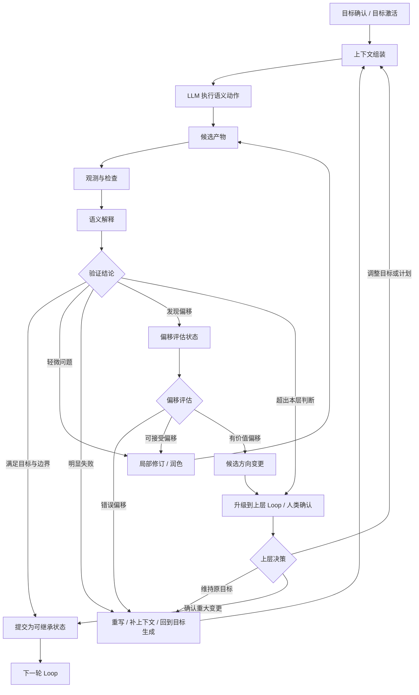

# Harness 设计原则

## 1. 文档定位

本文记录本项目的定位、核心工程判断和 Agent Loop Harness 设计原则。

本文不定义具体写作流程，不定义状态字段、工具接口或实现细节。本文只在原则层描述 loop 分层、LLM 与 harness 的职责边界。公开的实现说明由 [架构说明](./architecture.md)、[本地使用](./local-usage.md) 和代码本身承载。

## 2. 项目定位

本项目可以作为个人工程展示项目，并适合在 GitHub 公开展示。

它的主要价值不是证明“AI 可以写小说”，而是通过 AI 长篇小说写作这个具体领域，展示对 Agent Loop Harness 的工程理解。

AI 写小说是一个合适的领域载体，因为它天然需要长期运行、持续继承上下文、不断校验目标，并且很容易暴露 agent 系统的典型问题：

- 目标在长任务中逐渐衰减。
- 角色、设定、伏笔和剧情方向在执行中漂移。
- 单次生成看起来合理，但多轮累积后整体跑偏。
- 模型能继续生成内容，却不一定知道当前是否仍在完成原目标。

因此，本项目关注的问题可以表述为：

```text
如何设计一个能够长期运行，并且不容易在长期运行中跑偏的 Agent Loop Harness。
```

## 3. 核心判断

长期运行本身不是最难的问题。真正困难的是：系统在长期运行时，仍然知道自己要完成什么、当前做到哪里、是否已经偏离目标，以及偏离后应该如何恢复。

在 AI 小说写作中，LLM 很擅长执行生成任务。它可以写设定、写大纲、写章节、写对白，也可以继续生成很多轮内容。

但稳定写出没有明显缺陷的长篇小说，难点不只在“执行”，而在于执行之后能不能持续回答这些问题：

- 当前章节是否完成了本章目标？
- 角色行为是否仍符合已建立的动机、认知和关系？
- 世界设定、已发生事实和用户要求是否被破坏？
- 伏笔是否被遗忘、误回收、污染或无痕废弃？
- 新生成的内容是否偷偷改变了长期故事方向？
- 当前应该继续写、局部修订、重写、回到规划，还是暂停确认？

这些问题构成了本项目的核心工程场景。

### 3.1 稳定优先与质量增强边界

NovelPilot 不追求通过无限增加监督与修订机制获得理论上的最优文学质量。作为个人开发的模型主导型系统，目标是优先保证长流程生成能够稳定完成。Harness 只承担权限、状态、一致性、恢复和最低完成门禁；质量增强必须由真实长跑中的重复问题驱动，并证明其收益足以覆盖新增成本和失败面。

这条原则在设计评审中具有以下约束：

- 不因为某项额外评估、复盘或修订“理论上可能提高质量”，就默认把它加入正常生成链路。
- 最低完成门禁只拦截无法提交、明显违背已确认目标或 Canon、破坏上层正式契约、缺少必要结果等会使长流程失真的问题，不负责把合格候选持续优化到文学上的局部最优。
- 每个新增模型调用、语义门禁和修订分支都必须说明它解决了哪一种真实重复问题，以及新增的调用成本、超时风险、结构化输出失败和恢复分支。
- 未经真实长跑证据证明收益的质量机制，应记录为可选的后续增强，而不是预先进入稳定主链。
- 稳定性的首要验收是：正常输入下，系统能够在没有人工技术救援的情况下完成整条生成流程；质量评价不能通过制造无法收敛的监督循环来破坏这一目标。

## 4. 对 Loop 的理解

本项目中的 loop 不是简单地让 LLM 一直自我调用。

Loop 的主体是 harness：harness 决定每一轮怎么开始、给 LLM 什么上下文、如何处理 LLM 的输出，以及下一步是继续、提交、修订还是回退。LLM 负责完成其中需要语义能力的生成、判断和解释任务。

一个稳定的 agent loop 至少包含以下环节：

```text
定目标 -> 构造上下文 -> 执行 -> 观测与解释 -> 验证 -> 状态提交或纠偏 -> 下一轮
```

其中：

- 定目标：把用户需求、作品方向、当前阶段目标和本轮任务明确下来。
- 构造上下文：由 harness 决定本轮 LLM 应该看到什么目标、状态、历史、约束和工具。
- 执行：让 LLM 完成语义任务，例如规划、写作、审稿、抽取或解释偏差。
- 观测与解释：把执行结果转化为验证可以使用的信号，并在需要时让 LLM 解释语义变化。
- 验证：判断这些信号是否满足目标、边界和当前状态约束。
- 状态提交：只有通过边界控制的结果，才能进入下一轮可继承状态。
- 纠偏：在失败、偏离或不确定时，选择修订、重写、回到规划、暂停确认或恢复。

### 4.1 Loop 的终止契约

每一层 Loop 都必须定义与本层目标相匹配的明确终止契约，至少包括：

- 什么权威前置条件可以启动本层 Loop；
- 本层当前要完成的正式目标是什么；
- 哪些已提交结果可以作为本层的正式反馈；
- 哪些语义判据和确定性前置条件同时满足时才算通过；
- 通过、继续、修订、升级、等待用户和失败暂停分别进入什么显式状态。

次数、章节数、模型调用结束、流式输出结束和工作流步骤执行完毕都只能作为调度、预算或“触发检查”的条件，不能单独证明领域目标已经完成。下层 Loop 的提交也不能直接完成上层 Loop；上层必须使用自己的目标、正式反馈和通过标准形成显式终止决定。

每个正式终止都必须由 Harness 的 Domain Command 提交，并绑定当时的目标版本、正式反馈、验证证据和确定性前置条件。没有合法退出路径的失败不得保持 pending 或重新进入无限循环。

在这个结构里，最关键的不是“执行”本身，而是上下文构造、观测、验证和状态提交。

如果系统不能正确构造上下文，LLM 可能从一开始就在错误状态上执行；如果系统不能观测执行结果，它就不知道发生了什么；如果系统不能验证观测结果，它就不知道是否仍在正确方向上运行；如果系统不能控制状态提交，错误结果会进入下一轮上下文并被持续放大。

观测信号本身不是可继承状态。它先作为验证输入；只有通过验证并被提交或记录后，才会成为同层下一轮或上层 loop 可以继承的状态与反馈。

这样的 loop 即使能运行很久，也只是持续生成，而不是稳定推进。

### 4.2 层级权威与正式变更

三层 Loop 的语义权威遵循 `Book > Story Arc > Chapter`。影响范围越大的正式事实，判断和修改门槛越高。

跨层问题必须区分三个动作：

- 发现：当前层可以记录证据并指出可能影响直接上层；
- 判断：只有拥有被质疑契约的层级，才能审查该契约是否仍然有效、是否需要修订，或是否还要升级到自己的上层；
- 修改：正式 baseline 只能经过所属层级的候选生成、评估、相应审批和 Harness Domain Command 后产生新基线。

升级必须逐级进行。Chapter 只能提交 Chapter-to-Arc 审查请求，不能自行判定 Arc 契约错误，也不能直接升级到 Book；Arc 审查后如果认为需要改变全书承诺，只能提交 Arc-to-Book 审查请求，由 Book 层判断。变更请求只打开目标层的审查状态，不直接打开修订工作区，更不直接替换正式 baseline。

Arc 收束失败同样只是一项 Arc 层审查输入。即使 Arc 层确认需要修订，也必须由 ArcPlanner 提出候选、经过 Arc 评估和模式对应的批准，再由 Harness 提交新基线。Book baseline 的任何替换都必须经过 Book 层审阅，并在两种运行模式下都获得人工批准。

同层候选的一轮有界修复针对的是完整语义问题，不是 Evaluator 首次点名字段的
机械集合。Book/Arc 的 `observed_components` 只作诊断；Harness 按层冻结完整候选
修复包络，Repair Agent 可修正同一问题在包络内的全部出现位置，但不能触碰正式
baseline、Book 标题、历史 Arc 前缀或跨层内容。Chapter 仍按 plan/prose/
observation/Canon 的依赖关系使用精确组件授权。这个差异来自对象职责，而不是三层
生命周期原则不一致；所有层仍只有一轮纠正和一次关联复评。

### 4.3 已提交历史的有效性推定

一份内容经过所属层级评审、由 Harness 正式提交，并被后续内容持续依赖后，应当推定其在当前正式 lineage 中有效。新的模型评估、复盘或不同意见只能形成质疑、证据或变更建议，不能仅凭一次新的语义判断把旧 baseline 宣告为错误、失效或应被自动覆盖。

这项原则要求：

- 未通过审批的工作稿仍可在授权范围内原地修改；正式 baseline 只能由显式 successor 取代。
- 下游依赖越多、历史越深，正式修改门槛越高；上层批准解决的是修改权限，不能替代下游重建、重放和一致性验证机制。
- 在 successor 正式提交之前，旧 baseline 始终保持当前权威；即使被 successor 取代，也继续作为不可变、有效的历史证据保存，而不是被篡改或删除。
- Evaluator 只能报告旧历史可能存在的问题及证据。是否进入修订、等待用户或保留原历史，由 Harness 根据层级权威、当前 lineage 位置和系统实际具备的恢复能力决定。
- 首版只允许对当前 lineage 顶端的正式章节进行叙事内容修改。只要已经存在后续正式 Chapter、Arc closure 或 Book progress handoff，系统就只记录质疑或变更建议，不自动替换早期正式章节，也不假装已经完成历史 rebase/replay。

保持正文逐字不变、仅修正其派生 observations、证据或 Canon intent 的证据纠正不属于叙事历史重写，但仍必须证明修正内容已经存在于正式正文中，并检查相关下游内容不存在冲突。

### 4.4 用户输入与系统失败必须分流

全自动模式和参与模式共享同一条持久用户反馈通道。用户可以在生成运行时提交意见，但这不意味着修改正在执行的模型请求：

- 当前 LLM 原子动作继续执行，并完整保存本次动作实际产生的结果、用量和证据；
- 反馈先持久化，在该动作结束后的下一个安全边界由 Harness 注入；
- 注入前生成、且已经因反馈过时的结果保留为执行证据，但不能继续投递为当前领域状态；
- 反馈应用后必须重新读取权威状态再决定下一动作，不能依赖内存中的旧 Route。

同一冻结评审 lineage 最多自动向下纠正一轮，并在纠正后执行一次关联复评。复评仍要求同类向下纠正时，Harness 必须停止自动循环；Retry、重启、换 task ID 或换一种问题表述都不能重置这项领域预算。只有真实用户输入才能建立新的 `user_initiated` lineage，旧 lineage 仍保持不可变；新 lineage 同样受单轮纠正和一次关联复评限制，不能自行继续派生 lineage。

`waiting_for_user` 只表示用户确实拥有解决问题所需的事实或决策权。Provider、执行、投递、评估 Prompt/rubric/schema 或上下文装配问题属于系统责任；自动恢复预算耗尽后必须进入带真实 Agent 任务或真实 Harness 动作以及诊断证据的 `failure_paused`，不能为满足状态约束伪造 Agent 任务，也不能把工程缺陷包装成向用户提问。

Provider 返回成功状态但没有可消费最终输出属于执行异常，不是创作失败。Harness
应从实际响应 part 判断，而不是依赖框架异常文案；只有 thinking/空白而没有正文、
工具、refusal、文件或结构化结果时，重放完全相同的 Frozen Task Plan，并与其他
transport retry 共用既定六请求预算。预算耗尽后明确失败暂停，不能借此开启新的
语义修复或保持 pending。

## 5. 分层闭环 Agent Harness

本项目中的 loop 不是单层循环，而是分层闭环。

更准确地说，本项目把长篇小说写作建模为一个分层闭环 Agent Harness：

```text
全书 Loop
  故事弧 Loop
    章节 Loop
```

“分层闭环 Agent Harness”是本文对项目结构的描述，不把它当作行业固定术语。它对应的主流思想包括 hierarchical agent loop、closed-loop orchestration 和 multi-level feedback loop。

这种表述对应的是更通用的工程思想：高层 loop 负责长期目标和方向约束，低层 loop 负责局部执行和可提交进展；低层执行结果通过观测和验证反馈给高层，高层再决定是否维持方向、调整目标或触发纠偏。

在本项目中：

- 全书 Loop 负责长期方向、类型承诺、主线推进、角色长期弧线和终局目标。
- 故事弧 Loop 负责阶段目标、多章累积效果、节奏变化、阶段性伏笔推进和阶段收束。
- 章节 Loop 负责单章目标、正文生成、观测、验证、修订和提交。

三层 loop 不是并列任务，而是上下游关系：

- 全书目标约束故事弧目标。
- 故事弧目标约束章节目标。
- 章节执行结果反馈给故事弧。
- 故事弧结果反馈给全书方向。

因此，章节 loop 通过不代表故事弧一定健康；故事弧通过也不代表全书方向一定没有漂移。长篇写作需要多层 loop 分别承担不同时间尺度的目标约束、观测、验证和纠偏。

面向外部沟通时，可以把这个设计表述为：

```text
分层闭环 Agent Harness。
最内层是章节事务 loop，保证每章可观测、可验证、可提交；
中间是故事弧 loop，检查多章累积后是否完成阶段目标；
最外层是全书 loop，防止长期方向、类型承诺和终局目标漂移。
```

## 6. 三层 Loop 的运行结构

三层 loop 都遵循同一类基本环节：目标、上下文、执行、观测、验证、状态转移。但不同层级的目标来源、观测对象、验证口径和状态转移不同。

### 6.1 全书 Loop

全书 Loop 负责作品级方向。

目标来源：全书目标应由人类确认，LLM 可以辅助澄清、提案和整理，但不能单方面决定作品的最高层目标。全书目标包括类型、题材、核心卖点、读者承诺、主角长期方向、终局倾向，以及把这些承诺分解为有序语义 Arc 拓扑。

上下文构造：harness 应保留全书目标、已确认的长期方向、已提交故事弧结果、关键角色长期弧线和终局约束，并在需要做全书级判断时组织这些上下文。

执行：LLM 可以参与总结当前全书状态、解释长期偏差、提出 Book 候选和 Arc 拓扑候选。Book 只规划每个 Arc 的全书职责、核心目标、前序交接、退出条件与最终弧标记，不越级分配章节标题、章节事件、场景或每弧章数。

Book 还必须把每个正式 completion requirement 通过稳定 key 分配给至少一个
当前可执行 Arc。Harness 验证引用与覆盖完整性，Book Evaluator 在既有一次评审中
判断 Arc 目标/退出条件是否语义蕴含该 requirement：Arc 关闭后，要求中不可省略的
命名主体、行为、排除项、因果边、结果强度和证据预期必须必然成立。主题相容、
“澄清角色”或“排除统一布局”之类宽泛承诺，不能替代要求中明确的人物—行为—因果
责任；缺失或仅被暗示时属于 `strength_mismatch`，但不要求逐字复述。这属于全书
最低终止契约，而不是额外文学质量评审。completion-driven successor 的未解决要求
必须由未来 suffix 承担，不能只指向已完成的历史 prefix。

观测：全书 Loop 观测主线方向、类型承诺、主角长期弧线、核心卖点、终局方向和整体节奏。

验证：验证重点是整本书是否仍朝人类确认的目标推进，是否偏离读者承诺，是否接近完结，或是否需要重规划。

状态转移：harness 根据观测和验证结果决定维持当前 Book baseline、启动当前拓扑中的下一 Arc、提出需要人工批准的 Book successor，或在规划中的最终 Arc 正式收束后判断全书完成。章节数偏离只是一项观察，不能自动延展拓扑；非最终 Arc 收束也不需要一次例行 Book 模型复盘。

### 6.2 故事弧 Loop

故事弧 Loop 负责阶段性推进。

目标来源：当前故事弧的上层目标来自正式 Book baseline 中与当前 ordinal 唯一对应的 Arc contract。Arc Planner 根据该 contract、当前故事状态和上一弧 handoff 展开具体阶段契约；不能重新发明自己的全书职责。

上下文构造：harness 应为故事弧级判断提供当前精确 Book Arc contract、相关全书约束、上一弧 handoff、当前 Arc 的完整逐章大纲、弧内已提交章节、关键角色阶段状态、伏笔阶段状态和节奏历史。逐章大纲只覆盖当前 Arc 从生效点到收束所需的未来区间，不预写整本书，也不把其他未来 Arc 的完整拓扑暴露给 Chapter。

当前 Arc 只接收其 Book Arc contract 明确承担的 completion requirement 内容，
不接收整本 completion contract。Arc 负责把这些上层要求落实到 closure signals
和逐章大纲；Book 不因此获得章节规划权，Chapter 也不能重新解释 requirement 的
全书归属。

执行：Arc Planner 在 Arc 获批前同时提出阶段契约和完整逐章大纲；每个大纲项至少说明标题、核心事件、章末钩子和场景序列。LLM 也可以解释阶段偏差、判断多章累积效果，并在 Arc 层已获得修订权限时提出后继计划。大纲是宏观职责锚点，不是要求 Chapter 逐字复述的隐藏协议。

观测：故事弧 Loop 观测多章累积效果、阶段目标完成度、节奏变化、冲突升级、伏笔推进和关系转折。

验证：验证重点是当前故事弧是否完成阶段目标，是否仍服务全书目标，是否需要追加章节、压缩目标、重排节奏或回到阶段规划。

状态转移：harness 根据已提交事实和验证结果决定在当前正式 Arc baseline 的派生检查点前继续弧内章节；逐章大纲耗尽时只触发最低限度的 Arc 收束评估，不直接证明 Arc 已完成。只有 Arc 契约的收束条件被正式事实满足后才能退出当前 Arc；非最终 Arc 由 Harness 按 Book 拓扑确定性交接到下一 ordinal，最终 Arc 才进入 Book completion 判断。如果仍需生成新的故事事实，必须由 Arc 层审阅后通过正式 Arc 修订冻结新的未来计划和检查点，不能在原 baseline 下静默追加。Arc successor 只替换生效点之后的未来大纲，已提交章节继续绑定其当时的来源 baseline；同一个 Story Arc 的各 baseline 在读取时合并成一条连续 Arc。其他合法出口包括逐级升级到 Book Loop、要求下层证据纠正、等待用户或失败暂停。

### 6.3 章节 Loop

章节 Loop 负责单章事务。

目标来源：章节的宏观职责来自当前正式 Arc baseline 中由 Harness 确定性分配的逐章大纲项。Chapter Writer 根据该项、最新 Canon、已提交事实和上一章结果生成更细的单章计划，但不能重新发明本章在 Arc 中承担什么。

上下文构造：章节计划与正文任务获得当前大纲项和至多一个下一章大纲项，用于控制衔接；观察、Canon 抽取和章节评审只获得当前项。所有 Chapter 任务还应获得必要故事正史、相关角色状态、伏笔状态、世界规则、上一章结果和可用工具，但不获得当前 Arc 的其余远期逐章大纲。

执行：LLM 完成正文生成、局部修订、审稿判断、状态抽取或偏差解释等语义动作。

观测：章节 Loop 观测本章正文、本章事件、角色状态变化、伏笔动作、世界规则触及、用户要求触及和其他可能影响后续章节的状态变化。

验证：验证重点是本章是否在语义上完成当前大纲项的宏观职责，是否存在明显一致性问题，是否产生需要处理的状态变化，以及是否可以进入下一轮状态。标题、措辞、场景数量和事件表述不要求逐字或逐字段复刻；只有明显放弃、反转或违背本章职责，或者正式事实已经证明后续 Arc 计划不可行，才构成阻断或父层审查信号。

状态转移：harness 根据观测和验证结果决定提交章节、局部修订、重写、补充上下文、回到章节目标生成，或向故事弧 Loop 反馈阶段性偏差。

### 6.4 观测、验证与状态转移

观测不是普通日志。观测是在当前 loop 层级上，把执行结果转化为可反馈、可验证、可路由的信号。

验证不是让代码判断“小说好不好看”，也不是让 LLM 自己决定流程是否可以继续。LLM 可以给出语义判断；harness 决定验证何时发生、输入是什么、输出如何约束、结论是否生效，以及失败如何路由。

观测和验证本身不是最终动作。它们为 harness 提供状态转移信号：

- 观测提供事实变化、语义变化和阶段变化信号。
- 验证提供是否满足目标、边界和提交条件的判断信号。
- Harness 根据这些信号决定提交、继续、修订、重写、补上下文、回到规划、升级到上层 loop 或暂停等待人类确认。

观测结果不能直接成为下一轮状态。它先作为验证输入；通过验证并被提交或记录后，才成为同层下一轮或上层 loop 可以继承的状态与反馈。

### 6.5 整体状态转移视图

下图描述的是原则层的整体状态转移，不是最终实现中的状态字段或工具接口。它适用于全书 Loop、故事弧 Loop 和章节 Loop，只是不同层级的目标、上下文、检查维度、验证口径和升级对象不同。


```mermaid
flowchart TD
    A["目标确认 / 目标激活"] --> B["上下文组装"]
    B --> C["LLM 执行语义动作"]
    C --> D["候选产物"]
    D --> E["观测与检查"]
    E --> F["语义解释"]
    F --> G{"验证结论"}

    G -->|满足目标与边界| H["提交为可继承状态"]
    G -->|轻微问题| I["局部修订 / 润色"]
    G -->|明显失败| J["重写 / 补上下文 / 回到目标生成"]
    G -->|发现偏移| K["偏移评估状态"]
    G -->|超出本层判断| L["升级到上层 Loop / 人类确认"]

    I --> D
    J --> B

    K --> M{"偏移评估"}
    M -->|错误偏移| J
    M -->|可接受偏移| I
    M -->|有价值偏移| N["候选方向变更"]
    N --> L

    L --> P{"上层决策"}
    P -->|维持原目标| J
    P -->|调整目标或计划| B
    P -->|确认重大变更| H

    H --> O["下一轮 Loop"]
```

这个流程图强调三点：

- LLM 的生成、判断和解释结果默认都是候选产物，不直接改变可继承状态。
- 检查、评审和发现问题属于验证链路的一部分；验证的目标不是产生简单的通过或失败，而是形成可路由的结论。
- 偏移首先是观测事件。系统发现偏移后，应进入偏移评估状态，再判断它是错误偏移、可接受偏移，还是有价值的候选方向变更。

## 7. LLM 与 Harness 的边界

本项目不按“审稿”“检查”“状态抽取”等粗粒度任务来划分 LLM 与 harness 的边界。

这些任务都是复合任务。复合任务内部同时包含语义动作和控制动作，但两类动作的责任边界并不混合。

本项目按原子动作划分边界：

```text
LLM 负责语义原子动作。
Harness 负责控制原子动作。
```

LLM 负责：

- 理解用户创作意图。
- 提出、解释和细化候选故事方向与候选章节目标。
- 生成正文、对白、场景和叙事节奏。
- 判断章节是否有效、角色是否自然、读者期待是否被推进。
- 判断角色行为、设定使用、伏笔推进是否在语义上成立。
- 解释偏差原因。
- 提出修订、重写、状态变化或方向调整建议。

Harness 负责：

- 保存目标、状态、版本和历史记录。
- 保存、选择、激活和版本化目标，使候选目标在通过边界控制后才生效。
- 决定何时调用 LLM、调用哪个角色、传入哪些上下文。
- 控制每一轮 loop 的输入、输出和下一步路由。
- 定义哪些内容只是候选，哪些内容可以进入正式状态。
- 规定 LLM 输出的格式、证据要求和可接受结论。
- 管理工具权限、文件边界和写入位置。
- 触发观测和验证。
- 校验格式、版本、证据、权限和前置条件。
- 根据结果推动状态转移。
- 处理失败、重试、恢复、回滚和暂停确认。
- 保证流程可审计、可恢复、可重复执行。

因此，LLM 的输出默认不是事实，而是候选结果。候选结果只有在通过 harness 定义的边界和验证后，才能推动系统状态前进。

例如，“角色有没有崩”不是一个职责混合点，而是一个复合任务：

- Harness 决定何时检查角色一致性。
- Harness 准备角色稳定设定、当前状态、相关历史和本章正文。
- Harness 要求 LLM 输出结论、理由和文本证据。
- LLM 判断角色行为是否符合动机、认知、处境和关系。
- Harness 接收结论，并根据通过、警告、失败等结果决定继续、修订、重写或暂停。

因此，语义判断由 LLM 完成；判断动作的生命周期、输入输出约束和状态转移由 harness 控制。

## 8. 设计取向

本项目的设计取向是：不把 LLM 当成可靠的状态机，也不把 harness 做成替代 LLM 的创作系统。

更合理的方式是：

- 让 LLM 保留语义弹性和创作能力。
- 让 harness 约束状态边界、流程边界和提交边界。
- 按原子动作拆分 LLM 与 harness 的职责，不把复合任务误认为职责混合。
- 让每个关键节点都有可观测产物。
- 让每个关键产物进入下一阶段前都有验证。
- 让每种失败都有明确路由，而不是无限重试或静默继续。

这也是本项目希望展示的工程能力：不是简单调用模型，而是围绕一个真实领域设计可以长期运行、可观测、可验证、可恢复的 agent loop。

## 9. 对简历项目的意义

作为个人简历项目，本项目希望体现的不是单点 prompt 能力，而是以下工程理解：

- 如何把一个开放式语义任务转化为可运行的 loop。
- 如何区分 LLM 的语义职责和 harness 的控制职责。
- 如何设计长期任务中的目标、状态、观测、验证和纠偏。
- 如何让模型输出先成为候选，再经过边界控制进入正式状态。
- 如何通过领域问题展示 agent harness 的稳定性、可维护性和工程判断。

AI 小说写作是具体应用场景；Agent Loop Harness 是本项目真正要展示的工程主题。
